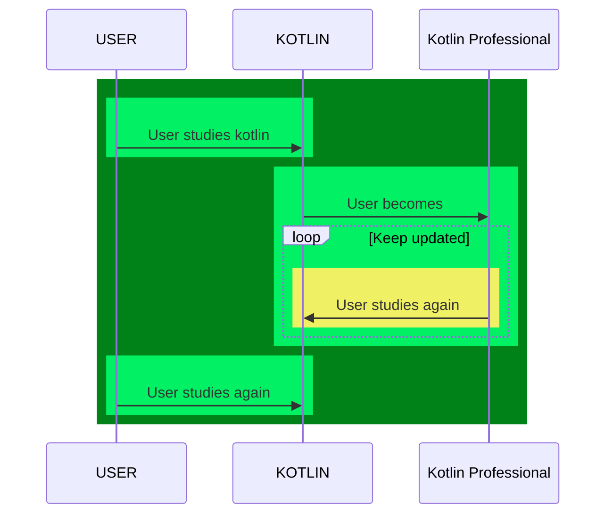

# jeorg-kotlin-test-drives

---

[](https://twitter.com/intent/tweet?text=%20Checkout%20this%20%40github%20repo%20by%20%40joaofse%20%F0%9F%91%A8%F0%9F%8F%BD%E2%80%8D%F0%9F%92%BB%3A%20https%3A//github.com/jesperancinha/kotlin-test-drives)
[](https://github.com/jesperancinha/kotlin-test-drives)
[](#)

[](https://circleci.com/gh/jesperancinha/jeorg-kotlin-test-drives)
[](https://ci.appveyor.com/project/jesperancinha/jeorg-kotlin-test-drives)

[](https://www.codacy.com/gh/jesperancinha/jeorg-kotlin-test-drives/dashboard?utm_source=github.com&amp;utm_medium=referral&amp;utm_content=jesperancinha/jeorg-kotlin-test-drives&amp;utm_campaign=Badge_Grade)
[](https://codebeat.co/projects/github-com-jesperancinha-jeorg-kotlin-test-drives-main)
[](https://bettercodehub.com/results/jesperancinha/jeorg-kotlin-test-drives)
[](https://snyk.io/test/github/jesperancinha/jeorg-kotlin-test-drives)

[](https://www.codacy.com/gh/jesperancinha/jeorg-kotlin-test-drives/dashboard?utm_source=github.com&utm_medium=referral&utm_content=jesperancinha/jeorg-kotlin-test-drives&utm_campaign=Badge_Coverage)
[](https://coveralls.io/github/jesperancinha/jeorg-kotlin-test-drives?branch=main)
[](https://codecov.io/gh/jesperancinha/jeorg-kotlin-test-drives)

[](#)
[](#)
[](#)

---

## Technologies used

---

[](https://kotlinlang.org/)
[](https://kotest.io/)
[](https://maven.apache.org/)

---

## Description

Kotlin Language study project.

## Contents

-   [Kotlin Crums](./jeorg-kotlin-crums) - Fast Track Crum modules
-   [Kotlin Utilities](./jeorg-kotlin-utilities) - Small modules with applications with the Kotlin language
-   [Kotlin Masters](./jeorg-kotlin-masters) - Developing applications using multiple topics in Kotlin

## Build

Note that if you want to build this project from the root, you need to use one of the JDK 11 or upper versions.

<i>See [Hints&Tricks](https://github.com/jesperancinha/project-signer/blob/master/project-signer-templates/Hints%26Tricks.md) document for more details</i>

## Install JDK 11 using [SDK-MAN](https://sdkman.io/)

```bash
sdk install java 11.0.9.hs-adpt
sdk use java 11.0.9.hs-adpt
```

Or just run:

```bash
. ./setup.sh
```

## Sequence Diagram



<i>Note: You need a Mermaid plugin extension</i> i.e. [mermaid-plugin](https://chrome.google.com/webstore/detail/mermaid-diagrams/phfcghedmopjadpojhmmaffjmfiakfil/related)

## Buy me a coffee

I hope you enjoyed this repository. If you did please buy me a coffee which enables me to constantly improve and make new free content regularly for everyone. Thank you so much!

<a href="https://www.buymeacoffee.com/jesperancinha" target="_blank"></a>

## References

### Books

-   Vasic, M. (21st May 2018). <i>Building Applications with Spring 5 and Kotlin</i>. (First Edition). Packt Publishing
-   Griffiths, D. Griffiths, D. (February 2019). <i>Head First A Brain-Friendly Guide</i>. (First Edition). O'Reilly
-   Skeen, J. Greenhalgh, D. (July 2018). <i>Kotlin Programming - The Big Nerd Ranch Guide</i>. (First Edition). Big Nerd Ranch
-   Jemerov, D. Isakova, S. (2017). <i>Kotlin in Action</i>. (First Edition). Manning Publications

## About me 👨🏽‍💻🚀🏳️‍🌈

[](http://joaofilipesabinoesperancinha.nl)
[](https://medium.com/@jofisaes)
[](https://www.credly.com/users/joao-esperancinha)
[](https://joaofilipesabinoesperancinha.nl/)
[](https://github.com/jesperancinha)
[](https://twitter.com/joaofse)
[](https://github.com/JEsperancinhaOrg)   
[](https://github.com/jesperancinha/project-signer/blob/master/project-signer-templates/Articles.md)
[](http://itf.joaofilipesabinoesperancinha.nl/)
[](https://joaofilipesabinoesperancinha.nl/badges)
[](https://github.com/jesperancinha/project-signer/blob/master/project-signer-quality/Build.md)
[](https://www.coursera.org/user/da3ff90299fa9297e283ee8e65364ffb)
[](https://play.google.com/store/apps/developer?id=Joao+Filipe+Sabino+Esperancinha)   
[](https://search.maven.org/search?q=org.jesperancinha)
[](https://hub.docker.com/u/jesperancinha)
[](https://stackoverflow.com/users/3702839/joao-esperancinha)
[](https://www.reddit.com/user/jesperancinha/)
[](https://dev.to/jofisaes)
[](https://hackernoon.com/@jesperancinha)
[](https://www.codeproject.com/Members/jesperancinha)
[](https://github.com/jesperancinha)
[](https://bitbucket.org/jesperancinha)
[](https://gitlab.com/jesperancinha)
[](https://bintray.com/jesperancinha)
[](https://www.freecodecamp.org/jofisaes)
[](https://www.hackerrank.com/jofisaes)
[](https://codeforces.com/profile/jesperancinha)
[](https://coderbyte.com/profile/jesperancinha)
[](https://www.codewars.com/users/jesperancinha)
[](https://codepen.io/jesperancinha)
[](https://news.ycombinator.com/user?id=jesperancinha)
[](https://www.infoq.com/profile/Joao-Esperancinha.2/)
[](https://www.linkedin.com/in/joaoesperancinha/)
[](https://www.xing.com/profile/Joao_Esperancinha/cv)
[](https://jofisaes.tumblr.com/)
[](https://nl.pinterest.com/jesperancinha/)
[](https://nl.quora.com/profile/Jo%C3%A3o-Esperancinha)

## Achievements

[](https://www.credly.com/badges/762fa7a4-9cf4-417d-bd29-7e072d74cdb7)
[](https://www.credly.com/badges/27a14e06-f591-4105-91ca-8c3215ef39a2)
[](https://www.credly.com/badges/87609d8e-27c5-45c9-9e42-60a5e9283280)
[](https://www.credly.com/badges/ad1f4abe-3dfa-4a8c-b3c7-bae4669ad8ce)
[](https://cancanit.com/certified/1462/)
[](https://graphacademy.neo4j.com/certificates/c279afd7c3988bd727f8b3acb44b87f7504f940aac952495ff827dbfcac024fb.pdf)
[](https://www.credly.com/badges/8d27e38c-869d-4815-8df3-13762c642d64)
